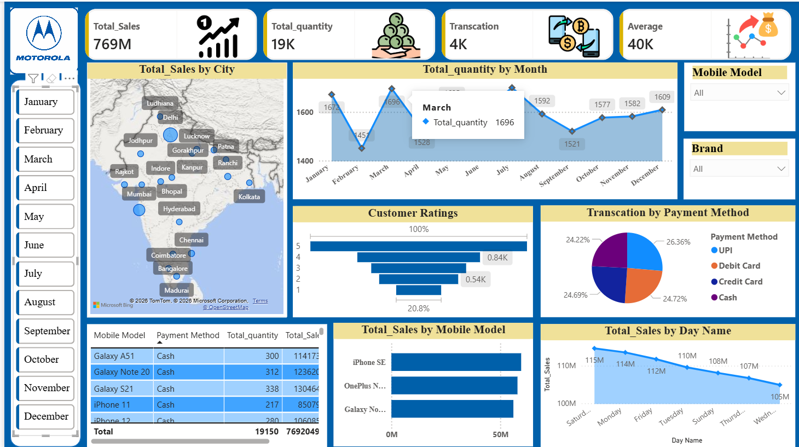

📊 Mobile Sales Dashboard (Power BI) 
🔹 Overview 

This project presents an interactive Mobile Sales Dashboard built using Power BI. The dataset (CSV file) was cleaned and transformed using Power Query, followed by data analysis and visualization to extract meaningful business insights. 

🔹 Project Description

The goal of this project is to analyze mobile sales data and uncover key insights related to sales performance, product trends, and customer behavior. 

The raw dataset was first processed using Power Query Editor for data cleaning and transformation. After preparing the data, an interactive dashboard was created in Power BI to visualize the findings in a clear and user-friendly manner. 

🔹 Key Features 
📊 Interactive dashboard with filters and slicers 
🧹 Data cleaning using Power Query 
📈 Visual representation of sales trends 
📍 Region-wise and product-wise analysis 
🔍 Insightful KPIs and performance metrics 
🔹 Tools & Technologies Used 
Power BI – Data visualization and dashboard creation
Power Query – Data cleaning and transformation
CSV Dataset – Raw data source 
🔹 Data Cleaning Process

The dataset was preprocessed using Power Query: 

Removed null and duplicate values 
Changed data types 
Renamed columns for better understanding 
Filtered irrelevant data 
Created calculated columns where necessary
🔹 Dashboard Insights 

Some key insights derived from the dashboard: 

📌 Top-performing mobile brands and models 
📌 Sales trends over time 
📌 Region-wise sales distribution 
📌 Revenue and quantity analysis 
📌 High-demand products 

